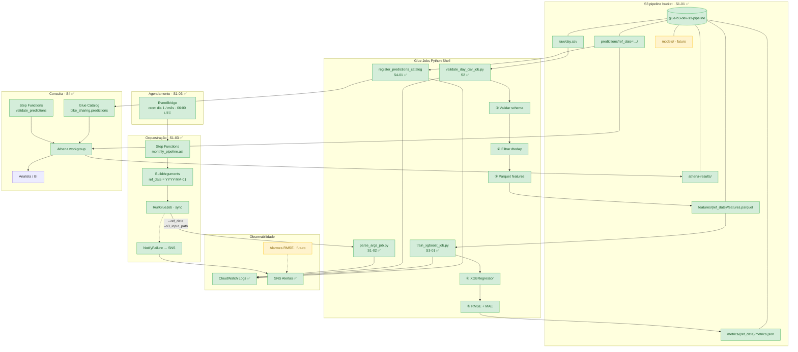
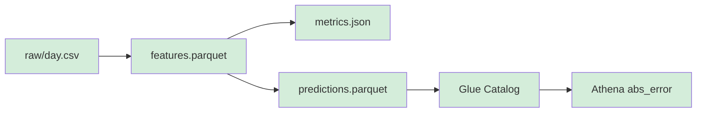

# project-glue-3 — Pipeline de Previsão de Demanda (AWS)

Infraestrutura como código (Terraform) para um **pipeline de previsão de demanda operacional** que roda automaticamente todo mês na AWS — orquestrado por Step Functions, processado por Glue Jobs e persistido no S3 para consulta no Athena.

> Neste repositório, a métrica simulada é **aluguéis de bike** (Bike Sharing). No contexto real, substitua por qualquer indicador que você precise prever com antecedência: vendas, chamados, consumo, acessos, volume de transações.

## O que o projeto simula

Um pipeline de ML de ponta a ponta que, **no primeiro dia de cada mês**, dispara sozinho, lê o histórico do período anterior, gera a previsão do comportamento futuro e deixa o resultado pronto para consulta — **sem intervenção humana**.

## Arquitetura



Legenda: **verde** = implementado (Sprint 1–4) · **amarelo** = próximas stories (inferência produção, persistência do modelo, alarmes).

### Fluxo de dados (Sprint 2 → 4)



| Etapa | Story | Entrada → Saída |
|-------|-------|-----------------|
| 1. Disparo | S1-03 | EventBridge → Step Functions |
| 2. Argumentos | S1-03 | `ref_date` + `s3://…/raw/day.csv` |
| 3. Validar schema | S2-01 | CSV → colunas obrigatórias |
| 4. Filtrar mês | S2-02 | `dteday` no mês/ano de `ref_date` |
| 5. Salvar features | S2-03 | Parquet em `features/{ref_date}/` |
| 6. Treinar modelo | S3-01 | Parquet → XGBoost + `metrics/{ref_date}/metrics.json` |
| 7. Predições | dev / futuro | `predictions/ref_date={ref_date}/predictions.parquet` |
| 8. Glue Catalog | S4-01 | Tabela `bike_sharing.predictions` + partição |
| 9. Consulta Athena | S4-02 | SQL com `abs_error`, ORDER BY `dteday` |

### O problema que resolve

| Sem pipeline | Com pipeline |
|--------------|--------------|
| Alguém puxa os dados manualmente | Step Functions dispara no dia 1 |
| Roda o modelo no notebook local | Glue Job executa na AWS |
| Salva o resultado em planilha/pasta | Resultado versionado no S3 |
| Avisa o time por e-mail/Slack manual | SNS + CloudWatch em caso de falha |

Hoje, sem automação, o fluxo é **lento, propenso a erro e não escala**. Este projeto modela a solução corporativa: agendamento, execução, persistência e observabilidade integrados.

### Perguntas de negócio que o pipeline responde

| Pergunta | Resposta do pipeline |
|----------|----------------------|
| Qual será a demanda do próximo período? | `cnt_pred` por dia em `predictions` |
| O modelo está acertando? | RMSE/MAE em `metrics.json` + `abs_error` no Athena (S4-02) |
| Quando o pipeline falhou ou degradou? | SNS + CloudWatch + alarmes (futuro) |

### Por que Bike Sharing?

O dataset de Bike Sharing tem **sazonalidade** (temperatura, estação do ano, dia da semana) — o mesmo tipo de padrão que modelos como XGBoost capturam bem e que aparece em problemas reais: previsão de estoque, ocupação hospitalar, volume de transações ou, neste projeto, métricas financeiras como série histórica da B3.

> **Guia para analistas:** [Dataset, tabelas e como usar o modelo](docs/guia-usuario-modelo.md)

> **Dica:** o dataset cobre **2011–2012**. Use `ref_date=2011-06-01` (ou outro mês desse intervalo) nos testes manuais.

## O que já está implementado

### Sprint 1 — Infraestrutura e orquestração

| Story | Entrega | Status |
|-------|---------|--------|
| S1-01 | Bucket S3 (`raw/`, `features/`, `metrics/`, `predictions/`, `models/`) + IAM Glue | ✅ |
| S1-02 | Glue Job `parse_args` (`--ref_date`, `--s3_input_path`) | ✅ |
| S1-03 | Step Functions + agendamento mensal + alertas SNS | ✅ |

### Sprint 2 — Ingestão e features

| Story | Entrega | Status |
|-------|---------|--------|
| S2-01 | Validar schema do `day.csv` (pandas + s3fs) | ✅ |
| S2-02 | Filtrar por `ref_date` (mês/ano de `dteday`) | ✅ |
| S2-03 | Salvar Parquet em `features/{ref_date}/features.parquet` | ✅ |

### Sprint 3 — Treino e inferência do modelo

| Story | Entrega | Status |
|-------|---------|--------|
| S3-01 | XGBRegressor, split 80/20 (`random_state=42`), RMSE/MAE no CloudWatch e `metrics/{ref_date}/metrics.json` | ✅ |
| S3-02 | Serializar modelo em `models/{ref_date}/model.pkl` (joblib); reutilizar se existir | ✅ |
| S3-03 | Job `predict-xgboost` → `predictions/ref_date={ref_date}/predictions.parquet` | ✅ |

### Sprint 4 — Catalog e Athena

| Story | Entrega | Status |
|-------|---------|--------|
| S4-01 | Tabela `bike_sharing.predictions` no Glue Catalog, partição `ref_date`, schema do Parquet | ✅ |
| S4-02 | Query Athena (`dteday`, `cnt_real`, `cnt_pred`, `abs_error`) + Step Functions parametrizável | ✅ |
| S4-03 | Alarmes CloudWatch (falha Glue + RMSE > threshold), SNS, SFN `train-with-observability` | ✅ |

**Pipeline mensal (`sfn-monthly-pipeline`):** encadeia S2 → treino → inferência → catalog → Athena automaticamente no dia 1 de cada mês.

## Início rápido

```powershell
# 1. Verificar credenciais AWS
aws sts get-caller-identity

# 2. Configurar variáveis
Copy-Item terraform.tfvars.example terraform.tfvars
# Edite aws_account_id com o Account da saída acima

# 3. Provisionar
terraform init
terraform apply -var-file="terraform.tfvars"

# 4. Testes locais
pip install -r requirements-dev.txt
python -m pytest tests/ -v

# 5. Testar o pipeline completo (Step Functions)
$SFN = terraform output -raw sfn_monthly_pipeline_arn
aws stepfunctions start-execution `
  --state-machine-arn $SFN `
  --name "test-$(Get-Date -Format 'yyyyMMdd-HHmmss')" `
  --input '{"ref_date":"2011-06-01"}'
```

## Executar Glue Jobs manualmente (PowerShell)

No PowerShell, **não use `\"`** dentro de `--arguments` — isso gera JSON inválido. Use uma das opções abaixo.

### Opção A — aspas simples (recomendado)

```powershell
$bucket = terraform output -raw s3_bucket_name
$ref    = "2011-06-01"

# S2 — gerar features Parquet
aws glue start-job-run `
  --job-name glue-b3-dev-glue-job-validate-day-csv `
  --arguments "{`"--ref_date`":`"$ref`",`"--s3_input_path`":`"s3://$bucket/raw/day.csv`"}"

# S3 — treinar XGBoost (requer features.parquet do passo anterior)
aws glue start-job-run `
  --job-name glue-b3-dev-glue-job-train-xgboost `
  --arguments "{`"--ref_date`":`"$ref`",`"--s3_input_path`":`"s3://$bucket/raw/day.csv`"}"

# S3-03 — inferência (requer model.pkl do treino)
aws glue start-job-run `
  --job-name glue-b3-dev-glue-job-predict-xgboost `
  --arguments "{`"--ref_date`":`"$ref`",`"--s3_input_path`":`"s3://$bucket/raw/day.csv`"}"
```

Alternativa com JSON literal (sem variáveis):

```powershell
aws glue start-job-run `
  --job-name glue-b3-dev-glue-job-train-xgboost `
  --arguments '{"--ref_date":"2011-06-01","--s3_input_path":"s3://glue-b3-dev-s3-pipeline-303238378103/raw/day.csv"}'
```

### Opção B — arquivo JSON

Crie `glue-args.json` (não commitar — está no `.gitignore` como `args.json`):

```json
{
  "--ref_date": "2011-06-01",
  "--s3_input_path": "s3://glue-b3-dev-s3-pipeline-303238378103/raw/day.csv"
}
```

```powershell
aws glue start-job-run `
  --job-name glue-b3-dev-glue-job-train-xgboost `
  --arguments file://glue-args.json
```

### Validar execução

```powershell
# Status do último run
aws glue get-job-runs `
  --job-name glue-b3-dev-glue-job-train-xgboost `
  --max-results 1 `
  --query "JobRuns[0].{State:JobRunState,Error:ErrorMessage}"

# Métricas no S3
aws s3 cp "s3://$bucket/metrics/$ref/metrics.json" -
```

**Critérios S3-01:** `JobRunState=SUCCEEDED`, log com `RMSE=` e `MAE=`, JSON com `"random_state": 42`, `"test_size": 0.2`.

> Jobs Python Shell rodam **1 execução por vez** — aguarde o run anterior terminar.

### Pipeline completo S2 → S4 (validação manual)

```powershell
$bucket = terraform output -raw s3_bucket_name
$ref    = "2011-06-01"
$raw    = "s3://$bucket/raw/day.csv"

# S2 — features
aws glue start-job-run --job-name glue-b3-dev-glue-job-validate-day-csv `
  --arguments "{`"--ref_date`":`"$ref`",`"--s3_input_path`":`"$raw`"}"

# S3 — treino + métricas + model.pkl
aws glue start-job-run --job-name glue-b3-dev-glue-job-train-xgboost `
  --arguments "{`"--ref_date`":`"$ref`",`"--s3_input_path`":`"$raw`"}"

# S3-03 — predições (substitui generate_sample_predictions.py)
aws glue start-job-run --job-name glue-b3-dev-glue-job-predict-xgboost `
  --arguments "{`"--ref_date`":`"$ref`",`"--s3_input_path`":`"$raw`"}"

# S4-01 — Glue Catalog
aws glue start-job-run --job-name glue-b3-dev-glue-job-register-predictions-catalog `
  --arguments "{`"--ref_date`":`"$ref`",`"--s3_input_path`":`"$raw`",`"--database_name`":`"bike_sharing`"}"

# S4-02 — Athena via Step Functions
$SFN = terraform output -raw sfn_validate_predictions_arn
aws stepfunctions start-execution --state-machine-arn $SFN --input "{`"ref_date`":`"$ref`"}"
```

Query SQL direta (Athena console ou CLI): ver [S4-02 — Query Athena](docs/s4-02-athena-query.md).

## Documentação

| Documento | Conteúdo |
|-----------|----------|
| [**Planejamento de sprints (Excel)**](docs/pipeline_xgboost_sprints.xlsx) | Backlog S1–S4 com user stories e critérios de aceite |
| [Getting Started](docs/getting-started.md) | Pré-requisitos, deploy, validação |
| [Arquitetura](docs/architecture.md) | Fluxo de dados, recursos AWS, IAM |
| [**Guia do usuário — dataset e modelo**](docs/guia-usuario-modelo.md) | Dataset Bike Sharing, tabelas Athena, como testar e usar predições |
| [**Guia de testes da esteira**](docs/pipeline-testing-guide.md) | Como devs validam S2→S4, pytest, checklist |
| [**Casos de uso comerciais**](docs/commercial-use-cases.md) | Cenários de negócio e como adaptar o pipeline |
| [S1-01 — Bucket S3](docs/s1-01-s3-bucket.md) | Estrutura de pastas e versionamento |
| [S1-02 — Glue Job](docs/s1-02-glue-job.md) | Argumentos, execução, logs |
| [S1-03 — Step Functions](docs/s1-03-step-functions.md) | Agendamento mensal, ASL, SNS, EventBridge |
| [S4-01 — Glue Catalog](docs/s4-01-glue-catalog.md) | Tabela `bike_sharing.predictions`, Lake Formation |
| [S4-02 — Query Athena](docs/s4-02-athena-query.md) | SQL `abs_error`, workgroup, Step Functions |
| [S4-03 — CloudWatch](docs/s4-03-cloudwatch.md) | Alarmes Glue/RMSE, dashboard, SNS |

## Estrutura do repositório

```
project-glue-3/
├── main.tf              # S3 bucket, versionamento, pastas
├── iam.tf               # Role Glue + policies S3/Catalog/Logs
├── glue.tf              # Glue Job parse_args (S1-02)
├── glue_validate.tf     # Glue Job validate_day_csv (S2)
├── glue_train.tf        # Glue Job train_xgboost (S3-01)
├── glue_catalog.tf      # Database bike_sharing + register catalog (S4-01)
├── athena.tf            # Workgroup + SFN validate_predictions (S4-02)
├── stepfunctions.tf     # State machine, EventBridge, SNS (S1-03)
├── stepfunctions_iam.tf
├── stepfunctions/
│   ├── monthly_pipeline.asl.json.tpl
│   └── validate_predictions.asl.json.tpl
├── athena/
│   └── predictions_validation.sql
├── scripts/
│   ├── parse_args_job.py              # S1-02
│   ├── validate_day_csv_job.py        # S2
│   ├── schema_validation.py           # S2 módulo
│   ├── train_xgboost_job.py           # S3-01
│   ├── xgboost_training.py            # S3-01 módulo
│   ├── sample_predictions.py          # dev: Parquet sample
│   ├── generate_sample_predictions.py # CLI sample
│   ├── register_predictions_catalog_job.py  # S4-01
│   ├── glue_catalog_predictions.py    # S4-01 boto3
│   └── athena_predictions_query.py    # S4-02 SQL builder
├── tests/
└── docs/
```

## Outputs principais

```powershell
terraform output s3_bucket_name                       # bucket pipeline
terraform output -raw sfn_monthly_pipeline_arn        # Step Functions
terraform output -raw glue_job_validate_day_csv_name  # job S2 (features Parquet)
terraform output -raw glue_job_train_xgboost_name              # job S3-01
terraform output -raw glue_job_register_predictions_catalog_name  # job S4-01
terraform output glue_predictions_database_name              # bike_sharing
terraform output -raw sfn_validate_predictions_arn             # Athena SFN S4-02
terraform output athena_workgroup_name                         # workgroup Athena
terraform output features_parquet_uri_template
terraform output metrics_json_uri_template
terraform output predictions_parquet_uri_template
terraform output athena_query_predictions_example
```
