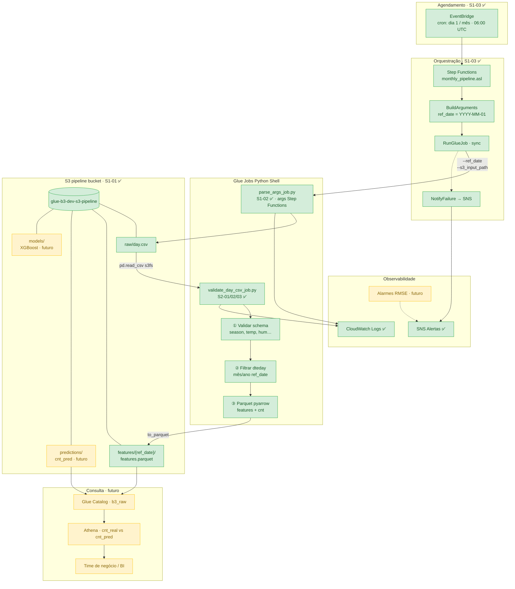
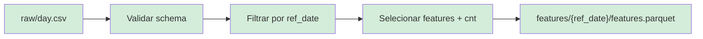

# project-glue-3 — Pipeline de Previsão de Demanda (AWS)

Infraestrutura como código (Terraform) para um **pipeline de previsão de demanda operacional** que roda automaticamente todo mês na AWS — orquestrado por Step Functions, processado por Glue Jobs e persistido no S3 para consulta no Athena.

> Neste repositório, a métrica simulada é **aluguéis de bike** (Bike Sharing). No contexto real, substitua por qualquer indicador que você precise prever com antecedência: vendas, chamados, consumo, acessos, volume de transações.

## O que o projeto simula

Um pipeline de ML de ponta a ponta que, **no primeiro dia de cada mês**, dispara sozinho, lê o histórico do período anterior, gera a previsão do comportamento futuro e deixa o resultado pronto para consulta — **sem intervenção humana**.

## Arquitetura



Legenda: **verde** = implementado (Sprint 1 + Sprint 2) · **amarelo** = próximas stories (treino XGBoost, inferência, Athena, alarmes).

### Fluxo de dados (Sprint 2)



| Etapa | Story | Entrada → Saída |
|-------|-------|-----------------|
| 1. Disparo | S1-03 | EventBridge → Step Functions |
| 2. Argumentos | S1-03 | `ref_date` + `s3://…/raw/day.csv` |
| 3. Validar schema | S2-01 | CSV → colunas obrigatórias |
| 4. Filtrar mês | S2-02 | `dteday` no mês/ano de `ref_date` |
| 5. Salvar features | S2-03 | Parquet em `features/{ref_date}/` |
| 6. Treino / inferência | futuro | XGBoost → `models/` + `predictions/` |
| 7. Consulta | futuro | Athena → `cnt_pred` vs `cnt_real` |

### O problema que resolve

| Sem pipeline | Com pipeline |
|--------------|--------------|
| Alguém puxa os dados manualmente | Step Functions dispara no dia 1 |
| Roda o modelo no notebook local | Glue Job executa na AWS |
| Salva o resultado em planilha/pasta | Resultado versionado no S3 |
| Avisa o time por e-mail/Slack manual | SNS + CloudWatch em caso de falha |

Hoje, sem automação, o fluxo é **lento, propenso a erro e não escala**. Este projeto modela a solução corporativa: agendamento, execução, persistência e observabilidade integrados.

### Perguntas de negócio que o pipeline responde

| Pergunta | Resposta do pipeline |
|----------|----------------------|
| Qual será a demanda do próximo período? | Predição `cnt_pred` por dia |
| O modelo está acertando? | Comparação `cnt_real` vs `cnt_pred` + RMSE |
| Quando o pipeline falhou ou degradou? | Alarmes CloudWatch + log de métricas |

### Por que Bike Sharing?

O dataset de Bike Sharing tem **sazonalidade** (temperatura, estação do ano, dia da semana) — o mesmo tipo de padrão que modelos como XGBoost capturam bem e que aparece em problemas reais: previsão de estoque, ocupação hospitalar, volume de transações ou, neste projeto, métricas financeiras como série histórica da B3.

## O que já está implementado

### Sprint 1 — Infraestrutura e orquestração

| Story | Entrega | Status |
|-------|---------|--------|
| S1-01 | Bucket S3 (`raw/`, `features/`, `predictions/`, `models/`) + IAM Glue | ✅ |
| S1-02 | Glue Job `parse_args` (`--ref_date`, `--s3_input_path`) | ✅ |
| S1-03 | Step Functions + agendamento mensal + alertas SNS | ✅ |

### Sprint 2 — Ingestão e features

| Story | Entrega | Status |
|-------|---------|--------|
| S2-01 | Validar schema do `day.csv` (pandas + s3fs) | ✅ |
| S2-02 | Filtrar por `ref_date` (mês/ano de `dteday`) | ✅ |
| S2-03 | Salvar Parquet em `features/{ref_date}/features.parquet` | ✅ |

Próximas stories: treino XGBoost, inferência, Glue Catalog, queries Athena.

## Início rápido

```powershell
# 1. Verificar credenciais AWS
aws sts get-caller-identity

# 2. Configurar variáveis
Copy-Item terraform.tfvars.example terraform.tfvars
# Edite aws_account_id com o Account da saída acima

# 3. Provisionar
terraform init
terraform apply -var-file="terraform.tfvars"

# 4. Testar o pipeline (Step Functions)
$SFN = terraform output -raw sfn_monthly_pipeline_arn
aws stepfunctions start-execution `
  --state-machine-arn $SFN `
  --name "test-$(Get-Date -Format 'yyyyMMdd-HHmmss')"
```

## Documentação

| Documento | Conteúdo |
|-----------|----------|
| [Getting Started](docs/getting-started.md) | Pré-requisitos, deploy, validação |
| [Arquitetura](docs/architecture.md) | Fluxo de dados, recursos AWS, IAM |
| [S1-01 — Bucket S3](docs/s1-01-s3-bucket.md) | Estrutura de pastas e versionamento |
| [S1-02 — Glue Job](docs/s1-02-glue-job.md) | Argumentos, execução, logs |
| [S1-03 — Step Functions](docs/s1-03-step-functions.md) | Agendamento mensal, ASL, SNS, EventBridge |

## Estrutura do repositório

```
project-glue-3/
├── main.tf              # S3 bucket, versionamento, pastas
├── iam.tf               # Role Glue + policies S3/Catalog/Logs
├── glue.tf              # Glue Job parse_args (S1-02)
├── glue_validate.tf     # Glue Job validate_day_csv (S2-01/02/03)
├── stepfunctions.tf     # State machine, EventBridge, SNS (S1-03)
├── stepfunctions_iam.tf
├── stepfunctions/
│   └── monthly_pipeline.asl.json.tpl
├── scripts/
│   ├── parse_args_job.py       # S1-02
│   ├── validate_day_csv_job.py # S2-01/02/03
│   └── schema_validation.py    # módulo compartilhado
├── tests/
└── docs/
```

## Outputs principais

```powershell
terraform output s3_bucket_name                    # bucket pipeline
terraform output -raw sfn_monthly_pipeline_arn     # Step Functions
terraform output -raw glue_job_validate_day_csv_name # job S2 (features Parquet)
terraform output features_parquet_uri_template     # s3://…/features/{ref_date}/features.parquet
```
