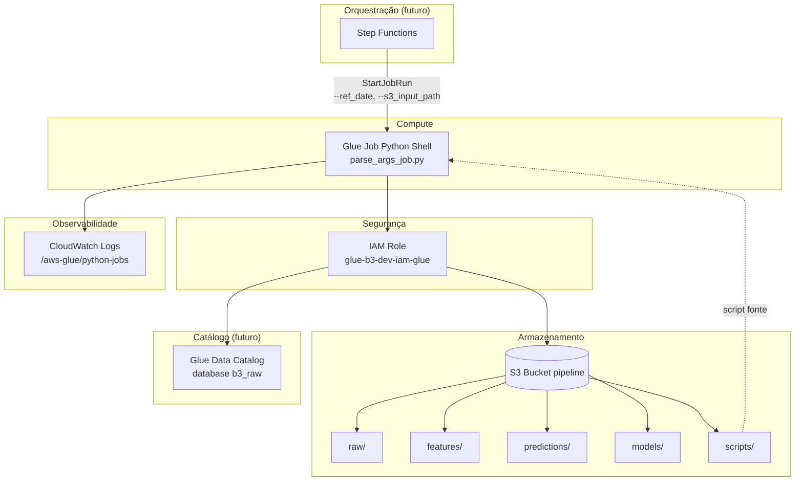
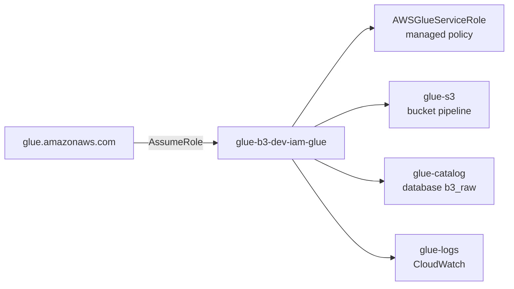

# Arquitetura

Visão geral da infraestrutura provisionada pelo Terraform neste repositório.

## Diagrama de componentes



## Fluxo de dados previsto

```
1. CSV bruto          → s3://{bucket}/raw/
2. Feature engineering → s3://{bucket}/features/
3. Modelo treinado     → s3://{bucket}/models/
4. Previsões           → s3://{bucket}/predictions/
```

O Glue Job S1-02 é o **primeiro job** do pipeline: recebe a data de referência e o caminho S3 de entrada via argumentos, preparando a integração com Step Functions nas stories seguintes.

## Recursos AWS

| Recurso | Terraform | Nome (dev) |
|---------|-----------|------------|
| S3 Bucket | `aws_s3_bucket.pipeline` | `glue-b3-dev-s3-pipeline-{account}` |
| S3 Versioning | `aws_s3_bucket_versioning.pipeline` | Enabled |
| S3 Public Access Block | `aws_s3_bucket_public_access_block.pipeline` | Bloqueio total |
| S3 Folders | `aws_s3_object.folders` | `raw/`, `features/`, `predictions/`, `models/` |
| S3 Script | `aws_s3_object.glue_script_parse_args` | `scripts/parse_args_job.py` |
| IAM Role | `aws_iam_role.glue` | `glue-b3-dev-iam-glue` |
| IAM Policy S3 | `aws_iam_role_policy.glue_s3` | List/Get/Put/Delete no bucket |
| IAM Policy Catalog | `aws_iam_role_policy.glue_catalog` | Leitura Glue Catalog `b3_raw` |
| IAM Policy Logs | `aws_iam_role_policy.glue_logs` | Escrita em `/aws-glue/python-jobs` |
| Glue Job | `aws_glue_job.parse_args` | `glue-b3-dev-glue-job-parse-args` |

## IAM — quem acessa o quê



| Policy | Escopo | Finalidade |
|--------|--------|------------|
| `AWSGlueServiceRole` | AWS managed | Operações padrão Glue |
| `glue-s3` | Bucket pipeline | Ler/gravar CSVs, modelos, scripts |
| `glue-catalog` | Database `b3_raw` | Consultar tabelas e partições |
| `glue-logs` | `/aws-glue/python-jobs` | Registrar stdout e logs do job |

## Arquivos Terraform por domínio

| Arquivo | Responsabilidade |
|---------|------------------|
| `main.tf` | Provider AWS, bucket S3, versionamento, pastas |
| `iam.tf` | Role e policies do Glue |
| `glue.tf` | Upload do script + definição do Glue Job |
| `locals.tf` | Nomenclatura centralizada |
| `variables.tf` | Entrada configurável |
| `outputs.tf` | Valores para scripts e integrações |

## Tags padrão

Aplicadas via `default_tags` no provider:

```
Project     = glue-b3
Environment = dev
ManagedBy   = terraform
Name        = <nome-do-recurso>
```

## Integração Step Functions (visão futura)

O Step Functions invocará o Glue Job passando argumentos dinâmicos:

```json
{
  "Type": "Task",
  "Resource": "arn:aws:states:::glue:startJobRun.sync",
  "Parameters": {
    "JobName": "glue-b3-dev-glue-job-parse-args",
    "Arguments": {
      "--ref_date.$": "$.ref_date",
      "--s3_input_path.$": "$.s3_input_path"
    }
  }
}
```

Detalhes em [S1-02 — Glue Job](s1-02-glue-job.md).
