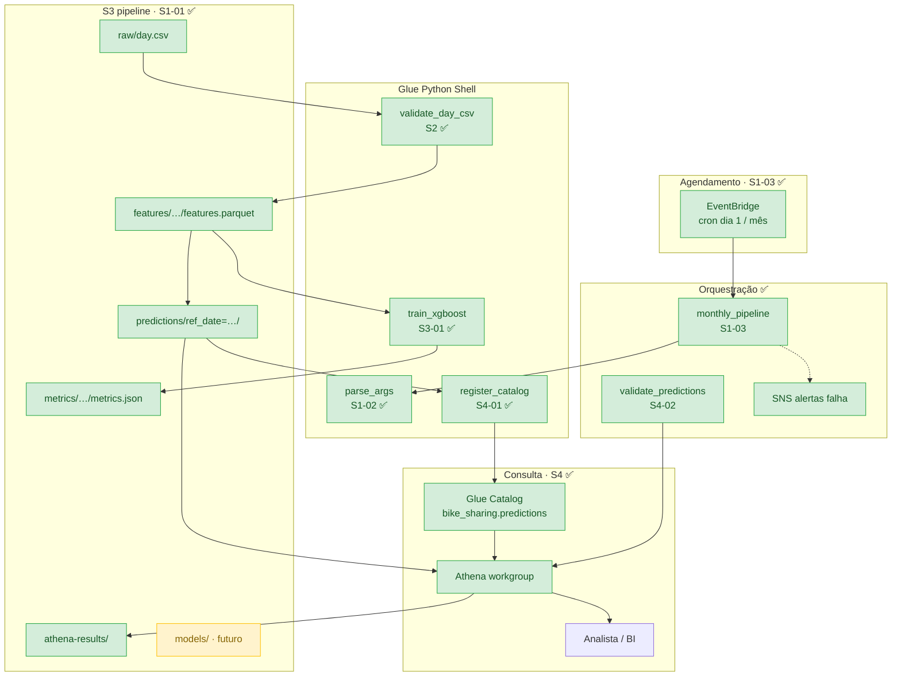
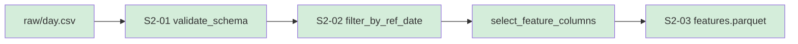
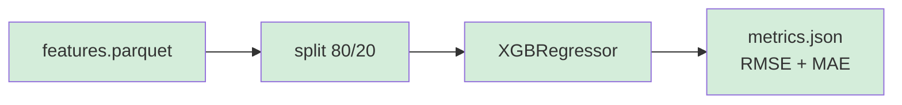
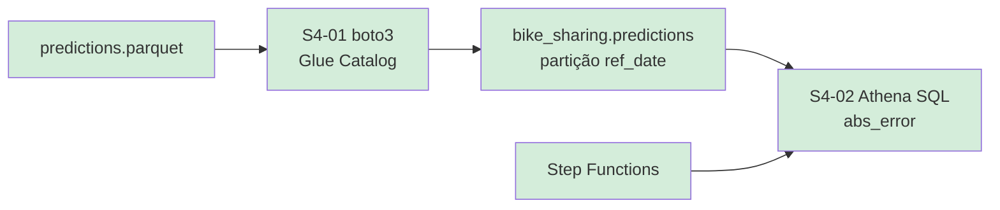
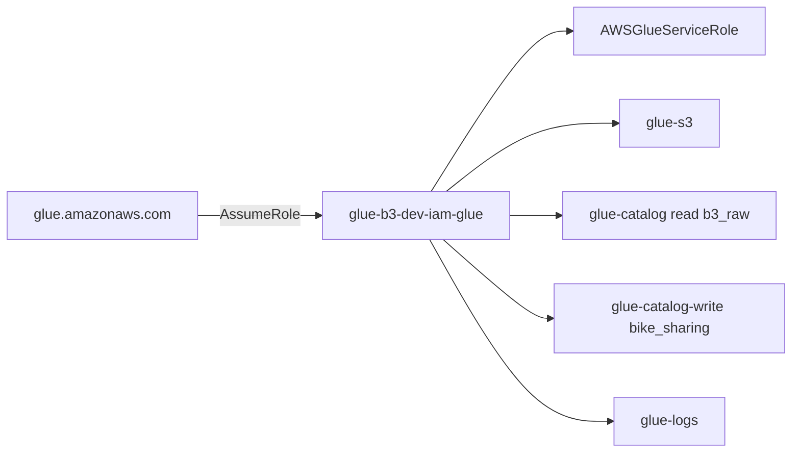

# Arquitetura

Visão geral da infraestrutura e do fluxo de dados do pipeline.

## Diagrama end-to-end



## Pipeline de features (Sprint 2)



## Pipeline de ML e métricas (Sprint 3)



## Catalog + Athena (Sprint 4)



| Passo | Story | Artefato |
|-------|-------|----------|
| Parquet predições | dev / futuro inferência | `predictions/ref_date={ref_date}/predictions.parquet` |
| Registro Catalog | S4-01 | Tabela + partição Hive |
| Query analista | S4-02 | SQL com `abs_error`, ORDER BY `dteday` |
| Orquestração query | S4-02 | `sfn-validate-predictions` + `$.ref_date` |

## Fluxo de dados no S3

```
1. CSV bruto      → s3://{bucket}/raw/day.csv
2. Features       → s3://{bucket}/features/{ref_date}/features.parquet        ✅ S2-03
3. Métricas       → s3://{bucket}/metrics/{ref_date}/metrics.json              ✅ S3-01
4. Predições      → s3://{bucket}/predictions/ref_date={ref_date}/predictions.parquet  ✅ S3-03
5. Resultados SQL → s3://{bucket}/athena-results/                              ✅ S4-02
6. Modelo         → s3://{bucket}/models/{ref_date}/model.pkl                  ✅ S3-02
```

## Recursos AWS

| Recurso | Terraform | Nome (dev) |
|---------|-----------|------------|
| S3 Bucket | `aws_s3_bucket.pipeline` | `glue-b3-dev-s3-pipeline-{account}` |
| Glue Job parse_args | `aws_glue_job.parse_args` | `glue-b3-dev-glue-job-parse-args` |
| Glue Job features | `aws_glue_job.validate_day_csv` | `glue-b3-dev-glue-job-validate-day-csv` |
| Glue Job treino | `aws_glue_job.train_xgboost` | `glue-b3-dev-glue-job-train-xgboost` |
| Glue Job inferencia | `aws_glue_job.predict_xgboost` | `glue-b3-dev-glue-job-predict-xgboost` |
| Glue Job catalog | `aws_glue_job.register_predictions_catalog` | `glue-b3-dev-glue-job-register-predictions-catalog` |
| Glue Database | `aws_glue_catalog_database.bike_sharing` | `bike_sharing` |
| Athena Workgroup | `aws_athena_workgroup.pipeline` | `glue-b3-dev-athena-pipeline` |
| SFN mensal | `aws_sfn_state_machine.monthly_pipeline` | `glue-b3-dev-sfn-monthly-pipeline` |
| SFN Athena | `aws_sfn_state_machine.validate_predictions` | `glue-b3-dev-sfn-validate-predictions` |
| IAM Role Glue | `aws_iam_role.glue` | `glue-b3-dev-iam-glue` |
| IAM Role SFN | `aws_iam_role.stepfunctions` | Glue + SNS + Athena |

Scripts S3: ver pasta `scripts/` — cada Glue Job tem entry point + módulo compartilhado.

## IAM — Glue



## IAM — Step Functions

| Policy | Finalidade |
|--------|------------|
| `sfn-glue-sns` | Glue Job mensal + alertas SNS |
| `sfn-athena` | Queries Athena, leitura `predictions/`, escrita `athena-results/`, Glue Catalog `bike_sharing` |

## Integração Step Functions

| State machine | Uso | Input |
|---------------|-----|-------|
| `monthly_pipeline` | S2→S3→inferência→catalog→Athena | `{"ref_date":"2011-06-01"}` (opcional; default = mês corrente) |
| `validate_predictions` | Query Athena parametrizada | `{"ref_date":"2011-06-01"}` |
| `train_with_observability` | Treino + inferência + rmse_threshold | `{"ref_date":"2011-06-01","rmse_threshold":500}` |

Ver [S1-03 — Step Functions](s1-03-step-functions.md), [Guia de testes](pipeline-testing-guide.md) e [S4-02](s4-02-athena-query.md).
