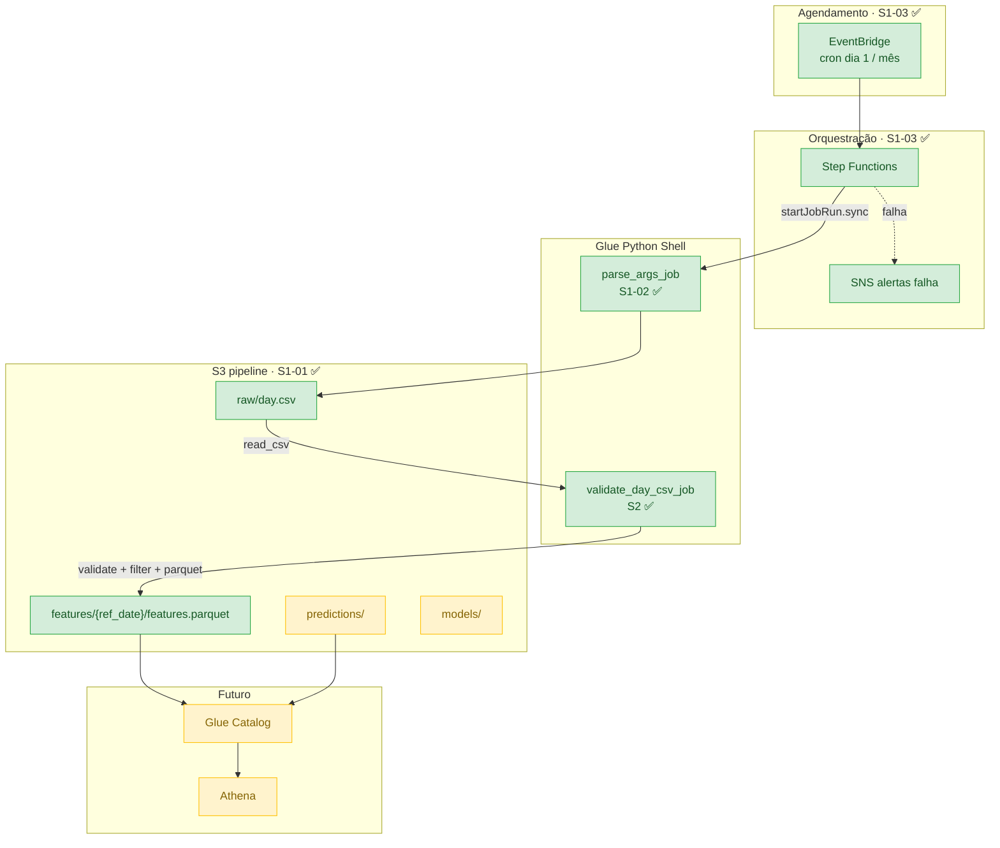
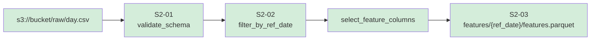
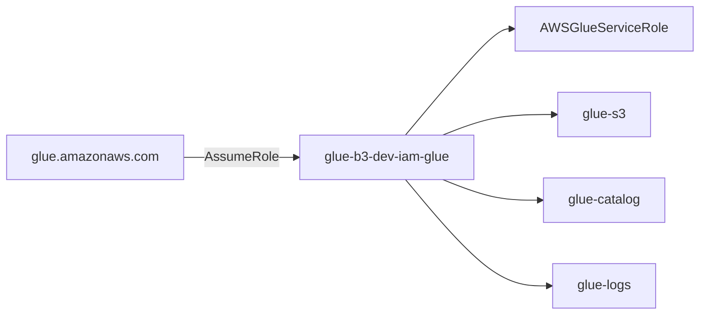

# Arquitetura

Visão geral da infraestrutura e do fluxo de dados do pipeline.

## Diagrama end-to-end



## Pipeline de features (Sprint 2)



| Passo | Módulo | Colunas / artefato |
|-------|--------|-------------------|
| Entrada | `read_day_csv_from_s3` | CSV completo com `dteday` |
| Validação | `validate_schema` | `season`, `temp`, `hum`, `windspeed`, `weekday`, `cnt`, `dteday` |
| Filtro | `filter_by_ref_date` | registros do mês/ano de `ref_date` |
| Seleção | `select_feature_columns` | features + target (`cnt`) |
| Saída | `save_features_parquet` | Parquet via pandas + pyarrow |

## Fluxo de dados no S3

```
1. CSV bruto     → s3://{bucket}/raw/day.csv
2. Features      → s3://{bucket}/features/{ref_date}/features.parquet   ✅ S2-03
3. Modelo        → s3://{bucket}/models/                               (futuro)
4. Previsões     → s3://{bucket}/predictions/                           (futuro)
```

## Recursos AWS

| Recurso | Terraform | Nome (dev) |
|---------|-----------|------------|
| S3 Bucket | `aws_s3_bucket.pipeline` | `glue-b3-dev-s3-pipeline-{account}` |
| S3 Versioning | `aws_s3_bucket_versioning.pipeline` | Enabled |
| Glue Job (args) | `aws_glue_job.parse_args` | `glue-b3-dev-glue-job-parse-args` |
| Glue Job (features) | `aws_glue_job.validate_day_csv` | `glue-b3-dev-glue-job-validate-day-csv` |
| State Machine | `aws_sfn_state_machine.monthly_pipeline` | `glue-b3-dev-sfn-monthly-pipeline` |
| EventBridge | `aws_cloudwatch_event_rule.monthly_pipeline` | cron dia 1 |
| SNS | `aws_sns_topic.pipeline_alerts` | alertas de falha |
| IAM Role Glue | `aws_iam_role.glue` | `glue-b3-dev-iam-glue` |
| IAM Role SFN | `aws_iam_role.stepfunctions` | Step Functions + Glue + SNS |

Scripts S3: `scripts/parse_args_job.py`, `scripts/validate_day_csv_job.py`, `scripts/schema_validation.py`

## IAM — Glue



| Policy | Finalidade |
|--------|------------|
| `glue-s3` | Ler `raw/`, gravar `features/`, `models/`, `predictions/` |
| `glue-catalog` | Leitura database `b3_raw` (futuro crawler) |
| `glue-logs` | CloudWatch `/aws-glue/python-jobs` |

## Integração Step Functions

Hoje o Step Functions invoca `parse_args_job` (S1-02). O job de features (`validate_day_csv`) roda manualmente ou será encadeado nas próximas stories:

```json
{
  "JobName": "glue-b3-dev-glue-job-validate-day-csv",
  "Arguments": {
    "--s3_input_path": "s3://bucket/raw/day.csv",
    "--ref_date": "2011-06-01"
  }
}
```

Ver [S1-03 — Step Functions](s1-03-step-functions.md) e scripts em `scripts/`.
