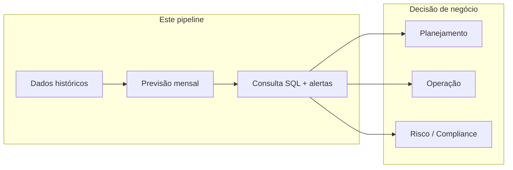

# Casos de uso comerciais e como utilizar este pipeline

Este documento explica **o que este repositório entrega como padrão reutilizável**, **como adaptar para o seu negócio** e **em quais cenários comerciais** a arquitetura se aplica — além do dataset de demonstração (Bike Sharing).

---

## O que você está comprando/adotando (padrão técnico)

Não é “só um job Glue”. É uma **referência de pipeline de previsão operacional mensal** na AWS:

| Camada | Componente | Valor de negócio |
|--------|------------|------------------|
| **Ingestão** | Validação de schema + Parquet particionado | Dados confiáveis antes de ML |
| **ML** | Treino batch (XGBoost) + métricas RMSE/MAE | Qualidade mensurável do modelo |
| **Serving analítico** | Predições no S3 + Glue Catalog + Athena | BI e analistas consultam sem engenharia |
| **Orquestração** | Step Functions | Execução repetível, auditável, parametrizável |
| **Observabilidade** | CloudWatch + SNS | Degradação e falha viram alerta, não surpresa |
| **Infra** | Terraform | Ambientes dev/stg/prod reproduzíveis |

---

## Mapeamento: Bike Sharing → seu domínio

Substitua mentalmente (e no código) estes conceitos:

| Neste repo (demo) | No seu produto |
|-------------------|----------------|
| `day.csv` — histórico diário | Seu fato operacional (vendas, chamados, transações…) |
| `dteday` — data do evento | Data de referência da métrica |
| `cnt` — demanda (aluguéis) | KPI alvo: volume, receita, ocupação, inadimplência… |
| `ref_date` — mês de corte | Período de fechamento / competência mensal |
| `features.parquet` | Features engineered para o modelo |
| `predictions.parquet` | Previsões por granularidade (dia, loja, SKU…) |
| `metrics.json` (RMSE/MAE) | SLA de acurácia do modelo |
| `bike_sharing.predictions` | Tabela de consumo para BI / auditoria |

O **fluxo** permanece: validar → transformar → treinar → prever → catalogar → consultar → monitorar.

---

## Cenários comerciais onde este padrão se aplica

### 1. Varejo e e-commerce — previsão de demanda

**Problema:** estoque, compras e logística dependem de estimativa de vendas por SKU/loja.

**Como usar:**
- Entrada: vendas diárias por loja (`ref_date` = mês de planejamento).
- Saída: previsão diária ou semanal por SKU; analistas cruzam `cnt_real` vs `cnt_pred` no Athena.
- Alerta S4-03: RMSE acima do limite → revisão de modelo ou promoção atípica.

**Quem beneficia:** supply chain, category managers, financeiro (forecast de receita).

---

### 2. Saúde — ocupação e demanda assistencial

**Problema:** dimensionar leitos, plantões e insumos com sazonalidade (surtos, feriados, clima).

**Como usar:**
- Entrada: admissões/atendimentos por dia e unidade.
- Features: dia da semana, feriado, temperatura (como no bike sharing).
- Athena: auditoria de “previsão vs realizado” por unidade (`abs_error`).

**Quem beneficia:** operações hospitalares, gestão de custos, compliance (evidência de planejamento).

---

### 3. Serviços financeiros — volume e série temporal

**Problema:** prever volume de transações, inadimplência, fluxo de caixa ou indicadores de mercado (contexto B3 do projeto).

**Como usar:**
- Troque `day.csv` por série histórica autorizada (transações agregadas, não PII).
- Partição mensal `ref_date` alinha com fechamento contábil.
- SNS alerta quando o modelo degrada (drift operacional).

**Quem beneficia:** risco, tesouraria, produtos, auditoria interna.

> **Compliance:** dados regulados exigem criptografia, Lake Formation, VPC endpoints e políticas de retenção — estenda o Terraform conforme política da instituição.

---

### 4. Logística e mobilidade

**Problema:** rotas, frota e staffing dependem de demanda espacial-temporal (ex.: bike sharing real, ride-hailing, entregas last-mile).

**Este repo é literalmente o caso bike sharing** — serve como POC para times de mobilidade e smart cities.

**Quem beneficia:** operações de campo, pricing dinâmico, expansão de hubs.

---

### 5. Energia e utilities — consumo e pico

**Problema:** prever consumo (kWh), pico de rede ou chamados de manutenção.

**Como usar:**
- Granularidade horária ou diária; `ref_date` mensal para fechamento tarifário.
- Alarmes quando erro de previsão impacta contrato de capacidade.

**Quem beneficia:** trading de energia, O&M, regulatorio.

---

### 6. Telecom e SaaS — tráfego e capacidade

**Problema:** escalar infra antes do pico (acessos, bandwidth, tickets de suporte).

**Como usar:**
- Métricas de uso agregadas → Parquet → treino → previsão de carga.
- Step Functions dispara no dia 1; capacity planning consome Athena/QuickSight.

**Quem beneficia:** SRE, FinOps, customer success (SLA).

---

### 7. RH e workforce — volume de demanda sobre equipe

**Problema:** escala de call center, horas de plantão, contratação sazonal.

**Como usar:**
- Target = volume de tickets/chamadas por dia.
- Previsão alimenta WFM (workforce management).

**Quem beneficia:** operações, RH, CFO (custo de pessoal).

---

## Matriz rápida: quando este padrão é adequado

| Critério | Adequado | Menos adequado |
|----------|----------|----------------|
| Dados históricos tabulares | ✅ CSV/Parquet com data | ❌ Só imagens/texto não estruturado |
| Horizonte previsível (ex.: mensal) | ✅ Batch no dia 1 | ❌ Previsão sub-segundo online |
| Consumo por analistas / BI | ✅ Athena + Catalog | ❌ Só API real-time sem lake |
| Equipe enxuta de dados | ✅ Glue serverless + Terraform | ❌ Já existe cluster Spark 24/7 dedicado |
| Necessidade de auditoria | ✅ Partições, métricas, logs | ❌ Caixa-preta sem rastreio |

---

## Como utilizar na prática (passos para o time de produto)

### Passo 1 — Definir o KPI e a granularidade

Exemplo varejo: “unidades vendidas por loja por dia, previsão para o mês seguinte”.

Documente:
- Coluna de data
- Coluna alvo (`cnt` equivalente)
- Chaves de partição (`ref_date`, `store_id`, …)

### Passo 2 — Adaptar ingestão (S2)

- Ajustar `schema_validation.py` para o schema do cliente.
- Mapear colunas de feature em `validate_day_csv_job.py` (ou módulo equivalente).
- Manter contrato S3: `features/{ref_date}/features.parquet`.

### Passo 3 — Adaptar modelo (S3)

- Hoje: `XGBRegressor` com split 80/20.
- Alternativas comerciais: Prophet (sazonalidade forte), LightGBM (volume), modelos por segmento.
- Manter `metrics.json` + CloudWatch para SLA de acurácia.

### Passo 4 — Produzir predições reais

- **Hoje:** `generate_sample_predictions.py` (demo).
- **Produção:** job Glue de inferência lendo modelo de `models/` e escrevendo `predictions/ref_date=…/`.

### Passo 5 — Expor para negócio (S4)

- Glue Catalog + Athena = self-service para analistas.
- Conectar QuickSight, Power BI ou Mode ao Athena/Glue.
- Query tipo S4-02 vira relatório de “acurácia operacional”.

### Passo 6 — Operar com confiança (S4-03)

- Threshold de RMSE acordado com negócio (ex.: erro médio ≤ 15% da demanda).
- SNS para on-call de dados quando job falha ou modelo degrada.
- Dashboard CloudWatch para review mensal com stakeholders.

### Passo 7 — Automatizar o mês

- Encadear jobs na Step Function mensal (roadmap).
- EventBridge `cron(0 6 1 * ? *)` no dia 1.
- Ambientes separados: `dev` / `stg` / `prod` via `terraform.tfvars`.

---

## Perfis que usam o pipeline

| Papel | Uso |
|-------|-----|
| **Engenheiro de dados** | Terraform, Glue jobs, S3, Catalog |
| **Cientista de dados** | Features, modelo, threshold RMSE |
| **Analista de BI** | Queries Athena, dashboards |
| **Product / Ops** | Interpretação de previsão vs realizado |
| **SRE / Plataforma** | Alarmes, SFN, custos AWS |
| **Auditoria / Risco** | Partições versionadas, trilha Step Functions |

---

## Proposta de valor (pitch interno ou comercial)

1. **Time-to-value:** infra e padrão prontos; troca-se dataset e schema em dias, não meses.
2. **Custo previsível:** Glue Python Shell + S3 + Athena sob demanda (sem cluster sempre ligado).
3. **Governança:** dados no seu bucket, Catálogo explícito, queries auditáveis.
4. **Qualidade visível:** RMSE/MAE por mês + alertas — negócio vê quando o modelo “sai do trilho”.
5. **Escala multi-cliente:** mesmo Terraform com `project_name`, `environment` e buckets por conta.

---

## Extensões recomendadas para produção comercial

| Extensão | Benefício comercial |
|----------|---------------------|
| Job de inferência + `models/` | Predições reais, não sample |
| SFN mensal encadeada S2→S4 | Zero touch no dia 1 |
| QuickSight dashboard | Consumo executivo |
| Lake Formation + colunas mascaradas | LGPD / PCI em ambientes regulados |
| Multi-tenant (`client_id` na partição) | SaaS de forecasting |
| CI/CD (GitHub Actions + `terraform plan`) | Releases controlados por cliente |

---

## Exemplo de narrativa para stakeholder

> “No dia 1 de cada mês, o pipeline lê o histórico validado, retreina o modelo de previsão de [demanda/volume/ocupação], grava as predições no data lake e registra no catálogo. Analistas consultam via SQL o erro dia a dia (`abs_error`). Se a acurácia cair abaixo do limite acordado ou o job falhar, o time recebe alerta por e-mail antes da reunião de planejamento.”

---

## Documentação relacionada

| Documento | Para quem |
|-----------|-----------|
| [**Guia do usuário — dataset e modelo**](guia-usuario-modelo.md) | Analistas/negócio — testar e usar predições |
| [Guia de testes da esteira](pipeline-testing-guide.md) | Devs — validar end-to-end |
| [Arquitetura](architecture.md) | Arquitetos — componentes AWS |
| [Getting Started](getting-started.md) | Novo dev — setup |
| [S4-02 — Athena](s4-02-athena-query.md) | Analistas — SQL de validação |
| [S4-03 — CloudWatch](s4-03-cloudwatch.md) | SRE — alarmes e métricas |
