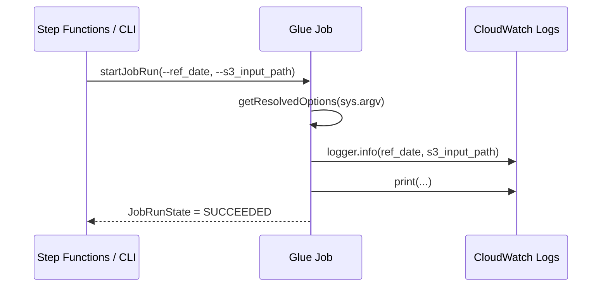

# S1-02 — Glue Job Python Shell

**Story:** Como engenheiro, quero configurar o Glue Job Python Shell para receber argumentos do Step Functions.

## Objetivo

Criar um Glue Job leve (Python Shell) que:

1. Lê `--ref_date` e `--s3_input_path` via `getResolvedOptions`
2. Registra os valores no CloudWatch Logs
3. Finaliza com status `SUCCEEDED`
4. Usa IAM role com acesso a S3 e Glue Catalog

## Recursos criados

| Recurso | Nome (dev) |
|---------|------------|
| Glue Job | `glue-b3-dev-glue-job-parse-args` |
| Script S3 | `s3://{bucket}/scripts/parse_args_job.py` |
| Script local | `scripts/parse_args_job.py` |
| Log Group | `/aws-glue/python-jobs` (criado pelo Glue em runtime) |

## Configuração do job

| Propriedade | Valor |
|-------------|-------|
| Tipo | Python Shell (`pythonshell`) |
| Glue Version | 3.0 |
| Python | 3.9 |
| Max Capacity | 0.0625 DPU |
| Timeout | 5 min |
| Continuous CloudWatch Log | habilitado |

### Argumentos padrão (defaults)

Definidos em `glue.tf` — sobrescritos pelo Step Functions ou `start-job-run`:

| Argumento | Default | Descrição |
|-----------|---------|-----------|
| `--ref_date` | `1970-01-01` | Data de referência do pipeline |
| `--s3_input_path` | `s3://{bucket}/raw/` | Caminho S3 de entrada |

## Como funciona o script

```python
from awsglue.utils import getResolvedOptions

args = getResolvedOptions(sys.argv, ["ref_date", "s3_input_path"])

logger.info("ref_date=%s", args["ref_date"])
logger.info("s3_input_path=%s", args["s3_input_path"])
```

### Fluxo de execução



### Atenção: Python Shell vs Spark

Em jobs **Python Shell**, `JOB_NAME` **não** é injetado em `sys.argv`. Incluí-lo em `getResolvedOptions` causa falha com exit code 2.

```python
# Correto (Python Shell)
args = getResolvedOptions(sys.argv, ["ref_date", "s3_input_path"])

# Incorreto — falha em Python Shell
args = getResolvedOptions(sys.argv, ["JOB_NAME", "ref_date", "s3_input_path"])
```

## Como executar

### Via AWS CLI (PowerShell)

```powershell
$JOB    = terraform output -raw glue_job_parse_args_name
$BUCKET = terraform output -raw s3_bucket_name

@'
{"--ref_date":"2024-06-01","--s3_input_path":"s3://BUCKET/raw/ibovespa.csv"}
'@.Replace("BUCKET", $BUCKET) | Set-Content args.json -Encoding ascii

$RUN = aws glue start-job-run `
  --job-name $JOB `
  --arguments file://args.json `
  --query JobRunId --output text

Write-Host "JobRunId: $RUN"
```

### Aguardar conclusão

```powershell
do {
  Start-Sleep -Seconds 10
  $status = aws glue get-job-run --job-name $JOB --run-id $RUN `
    --query JobRun.JobRunState --output text
  Write-Host "Status: $status"
} while ($status -in @("RUNNING", "STARTING"))
```

### Verificar status e argumentos usados

```powershell
aws glue get-job-run --job-name $JOB --run-id $RUN `
  --query "JobRun.{State:JobRunState,Arguments:Arguments,Error:ErrorMessage}" `
  --output json
```

Esperado:

```json
{
    "State": "SUCCEEDED",
    "Arguments": {
        "--ref_date": "2024-06-01",
        "--s3_input_path": "s3://glue-b3-dev-s3-pipeline-303238378103/raw/ibovespa.csv"
    },
    "Error": null
}
```

## CloudWatch Logs

Com `--enable-continuous-cloudwatch-log = true`, stdout e `logger.info` vão para:

```
/aws-glue/python-jobs
```

Conteúdo esperado no log:

```
INFO ref_date=2024-06-01
INFO s3_input_path=s3://.../raw/ibovespa.csv
ref_date: 2024-06-01
s3_input_path: s3://.../raw/ibovespa.csv
```

Para consultar logs (requer permissão `logs:FilterLogEvents` no seu usuário):

```powershell
aws logs filter-log-events `
  --log-group-name "/aws-glue/python-jobs" `
  --filter-pattern "ref_date" `
  --limit 10
```

## Integração com Step Functions

Exemplo de state que invoca o job e aguarda conclusão:

```json
{
  "StartGlueJob": {
    "Type": "Task",
    "Resource": "arn:aws:states:::glue:startJobRun.sync",
    "Parameters": {
      "JobName": "glue-b3-dev-glue-job-parse-args",
      "Arguments": {
        "--ref_date.$": "$.ref_date",
        "--s3_input_path.$": "$.s3_input_path"
      }
    },
    "End": true
  }
}
```

Input de exemplo para a state machine:

```json
{
  "ref_date": "2024-06-01",
  "s3_input_path": "s3://glue-b3-dev-s3-pipeline-303238378103/raw/ibovespa.csv"
}
```

## Integração via boto3

```python
import boto3

glue = boto3.client("glue")

response = glue.start_job_run(
    JobName="glue-b3-dev-glue-job-parse-args",
    Arguments={
        "--ref_date": "2024-06-01",
        "--s3_input_path": "s3://glue-b3-dev-s3-pipeline-303238378103/raw/ibovespa.csv",
    },
)

run_id = response["JobRunId"]
print(f"JobRunId: {run_id}")
```

## Atualizar o script

1. Edite `scripts/parse_args_job.py`
2. Execute `terraform apply` — o `etag` do `aws_s3_object` detecta mudanças e reenvia o script ao S3
3. Novas execuções do job usam a versão atualizada automaticamente

## Critérios de aceite

| Critério | Status |
|----------|--------|
| Job aceita `--ref_date` e `--s3_input_path` | ✅ |
| Argumentos logados no CloudWatch | ✅ |
| Job finaliza com `SUCCEEDED` | ✅ |
| IAM role com S3 e Glue Catalog | ✅ |

## Troubleshooting

| Sintoma | Causa provável | Solução |
|---------|----------------|---------|
| `Command failed with exit code 2` | Argumento ausente ou `JOB_NAME` em `getResolvedOptions` | Verifique nomes dos args; remova `JOB_NAME` em Python Shell |
| `AccessDenied` no S3 | Role sem policy | Verifique `aws_iam_role_policy.glue_s3` |
| Logs não aparecem | Usuário sem permissão de leitura em CloudWatch | Normal — o job ainda executa; peça permissão `logs:FilterLogEvents` ou veja no console Glue |
| Argumentos não sobrescritos | JSON mal formatado no CLI | Use arquivo `args.json` com `file://args.json` |

## Outputs úteis

```powershell
terraform output -raw glue_job_parse_args_name
terraform output -raw glue_job_parse_args_arn
terraform output -raw glue_script_parse_args_s3_uri
terraform output -raw glue_role_arn
```
