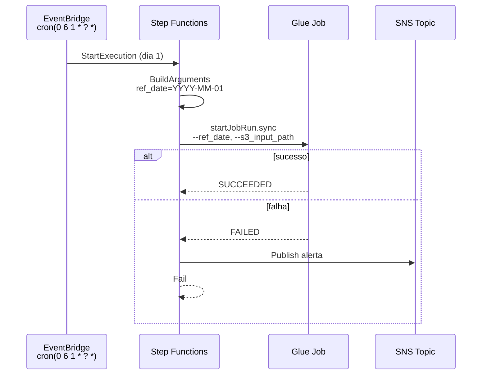

# S1-03 — Step Functions Mensal

**Story:** Como engenheiro, quero configurar o Step Functions para disparar o Glue Job mensalmente com os argumentos corretos.

## Objetivo

Orquestrar o pipeline mensal:

1. **EventBridge** dispara no dia 1 de cada mês
2. **Step Functions** calcula `ref_date` (primeiro dia do mês) e monta `s3_input_path`
3. **Glue Job** é invocado com `startJobRun.sync`
4. **SNS** notifica em caso de falha

## Arquitetura



## Recursos criados

| Recurso | Nome (dev) |
|---------|------------|
| State Machine | `glue-b3-dev-sfn-monthly-pipeline` |
| EventBridge Rule | `glue-b3-dev-eventbridge-monthly-pipeline` |
| SNS Topic | `glue-b3-dev-sns-pipeline-alerts` |
| IAM Role SFN | `glue-b3-dev-iam-stepfunctions` |
| IAM Role EventBridge | `glue-b3-dev-iam-eventbridge-sfn` |

## Definição ASL

Arquivo: [`stepfunctions/monthly_pipeline.asl.json.tpl`](../stepfunctions/monthly_pipeline.asl.json.tpl)

### Legendas no console Step Functions

Na interface AWS, cada **caixa do grafo** mostra o **nome do estado** (legenda curta). A **descrição completa** fica no campo `Comment` do ASL:

1. Console → **Step Functions** → state machine → aba **Definition** ou **Edit**
2. Clique em um estado (ex.: `Glue_S2_ValidarCSV_Features`)
3. Painel lateral / Code: campo **Comment** com explicação em português

| Prefixo no nome | Significado na interface |
|-----------------|--------------------------|
| `00_`, `01_`, `01A_` | Preparação (`ref_date`, argumentos) |
| `Glue_S2_*` | Glue Job — feature engineering |
| `Glue_S3_*` | Glue Job — treino ou inferência ML |
| `Glue_S4_*` | Glue Job — Glue Catalog |
| `Prep_S4_*` | Pass — monta SQL Athena |
| `Athena_S4_*` | Task — executa query Athena |
| `Alerta_SNS_*` | Notificação de falha |
| `Falha_*` | Estado terminal de erro |

### Estados (pipeline mensal completo)

| Estado | Tipo | Glue / serviço |
|--------|------|----------------|
| `00_EscolherRefDate` | Choice | Input manual ou mês corrente |
| `01A_RefDatePrimeiroDiaMes` | Pass | Calcula YYYY-MM-01 |
| `01_MontarArgumentos` | Pass | Paths S3, Athena, CloudWatch |
| `Glue_S2_ValidarCSV_Features` | Task sync | `validate-day-csv` |
| `Glue_S3_TreinarXGBoost` | Task sync | `train-xgboost` |
| `Glue_S3_InferirPredicoes` | Task sync | `predict-xgboost` |
| `Glue_S4_RegistrarGlueCatalog` | Task sync | `register-predictions-catalog` |
| `Prep_S4_MontarQueryAthena` | Pass | SQL `abs_error` |
| `Athena_S4_ValidarPredicoes` | Task sync | Athena |
| `Alerta_SNS_Falha` | Task | SNS |
| `Falha_Pipeline` | Fail | — |

### Cálculo de `ref_date`

Usa `$$.Execution.StartTime` (ISO 8601) e extrai ano/mês:

```
ref_date = YYYY-MM-01
```

Exemplo: execução em `2024-06-06T06:00:00Z` → `ref_date = 2024-06-01`

### `s3_input_path`

Fixo no template Terraform:

```
s3://glue-b3-dev-s3-pipeline-{account}/raw/day.csv
```

## Agendamento EventBridge

| Propriedade | Valor padrão |
|-------------|--------------|
| Expressão cron | `cron(0 6 1 * ? *)` |
| Significado | Dia **1** de cada mês, **06:00 UTC** |
| Estado | `ENABLED` |

Personalize em `terraform.tfvars`:

```hcl
monthly_pipeline_schedule     = "cron(0 6 1 * ? *)"
monthly_pipeline_enabled      = true
create_eventbridge_schedule   = true   # false se nao tiver events:PutRule
```

### Criar EventBridge manualmente (sem events:PutRule no Terraform)

Se `create_eventbridge_schedule = false`, crie a regra via CLI (requer permissao ou admin):

```powershell
$SFN  = terraform output -raw sfn_monthly_pipeline_arn
$ROLE = aws iam get-role --role-name glue-b3-dev-iam-eventbridge-sfn --query Role.Arn --output text

aws events put-rule `
  --name glue-b3-dev-eventbridge-monthly-pipeline `
  --schedule-expression "cron(0 6 1 * ? *)" `
  --state ENABLED

aws events put-targets `
  --rule glue-b3-dev-eventbridge-monthly-pipeline `
  --targets "Id=monthly-pipeline-sfn,Arn=$SFN,RoleArn=$ROLE"
```

## Alertas SNS

O topico SNS **nao e gerenciado** pelo Terraform por padrao (`create_sns_topic = false`) — contas com IAM limitado falham em `sns:ListTagsForResource`.

Configure em `terraform.tfvars`:

```hcl
sns_pipeline_alerts_arn = "arn:aws:sns:us-east-1:303238378103:glue-b3-dev-sns-pipeline-alerts"
create_sns_topic        = false
```

Inscricao de e-mail (manual — evita `sns:GetSubscriptionAttributes`):

```powershell
aws sns subscribe `
  --topic-arn arn:aws:sns:us-east-1:303238378103:glue-b3-dev-sns-pipeline-alerts `
  --protocol email `
  --notification-endpoint welligtoncos@gmail.com
```

Confirme a inscricao no link enviado pela AWS.

## Critérios de aceite

| Critério | Status |
|----------|--------|
| State machine criada e ativa | ✅ |
| EventBridge agenda dia 1 de cada mês | ✅ |
| Argumentos chegam corretamente ao Glue Job | ✅ |
| Falha do job gera notificação SNS | ✅ |

## Como usar

### Deploy

```powershell
terraform apply -var-file="terraform.tfvars"
```

### Executar manualmente (teste)

```powershell
$SFN = terraform output -raw sfn_monthly_pipeline_arn
Write-Host "State machine: $SFN"

$EXEC = aws stepfunctions start-execution `
  --state-machine-arn $SFN `
  --name "test-manual-$(Get-Date -Format 'yyyyMMdd-HHmmss')" `
  --query executionArn --output text

Write-Host "ExecutionArn: $EXEC"

do {
  Start-Sleep -Seconds 10
  $status = aws stepfunctions describe-execution --execution-arn $EXEC --query status --output text
  Write-Host "Status: $status"
} while ($status -eq "RUNNING")

aws stepfunctions describe-execution --execution-arn $EXEC `
  --query "{status:status,output:output}" --output json
```

Esperado: `"status": "SUCCEEDED"` com `--ref_date` = `YYYY-MM-01` e `--s3_input_path` = `.../raw/day.csv`.

### Verificar argumentos no Glue

```powershell
# Obter JobRunId do output da execucao Step Functions
$JOB = terraform output -raw glue_job_parse_args_name
aws glue get-job-runs --job-name $JOB --max-results 1 `
  --query "JobRuns[0].{State:JobRunState,Arguments:Arguments}" --output json
```

Esperado:

```json
{
    "State": "SUCCEEDED",
    "Arguments": {
        "--ref_date": "2024-06-01",
        "--s3_input_path": "s3://glue-b3-dev-s3-pipeline-303238378103/raw/day.csv"
    }
}
```

### Verificar EventBridge

```powershell
$RULE = terraform output -raw eventbridge_monthly_pipeline_rule
aws events describe-rule --name $RULE
aws events list-targets-by-rule --rule $RULE
```

Esperado: `"State": "ENABLED"` e target apontando para a state machine.

### Testar notificação SNS (simular falha)

Renomeie temporariamente o Glue Job ou passe job inválido via execução customizada — ou altere o ASL em dev. Em produção, falhas reais do Glue disparam `NotifyFailure` automaticamente.

## Outputs

```powershell
terraform output -raw sfn_monthly_pipeline_name
terraform output -raw sfn_monthly_pipeline_arn
terraform output -raw sns_pipeline_alerts_arn
terraform output -raw s3_input_day_csv_path
```

## Troubleshooting

| Sintoma | Causa | Solução |
|---------|-------|---------|
| `AccessDenied` no StartExecution | Role EventBridge sem permissão | Verifique `aws_iam_role_policy.eventbridge_start_sfn` |
| `sns:ListTagsForResource` no apply | IAM limitado | Use `create_sns_topic = false` e `sns_pipeline_alerts_arn` |
| `events:PutRule` no apply | IAM limitado | Use `create_eventbridge_schedule = false` e crie regra via CLI |
| `$SFN` vazio no CLI | Output ainda nao existe | Rode `terraform apply` com sucesso antes |
| Glue job não recebe args | ASL incorreto | Confira `BuildArguments` e `Arguments` em `RunGlueJob` |
| SNS não chega | E-mail não confirmado | Confirme inscrição no SNS |
| EventBridge não dispara | Regra desabilitada ou cron errado | `aws events describe-rule` |
